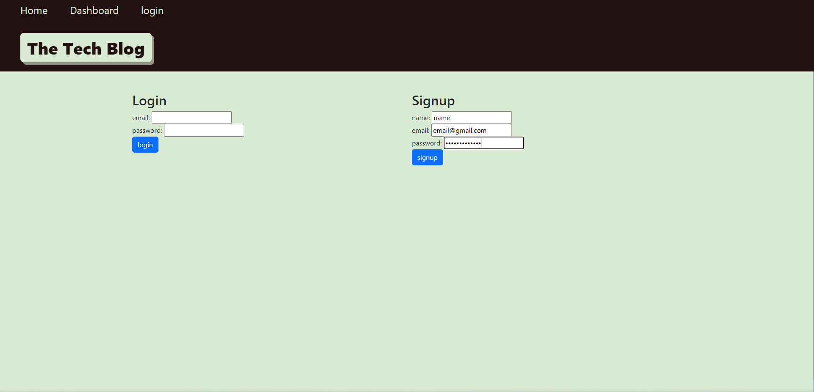
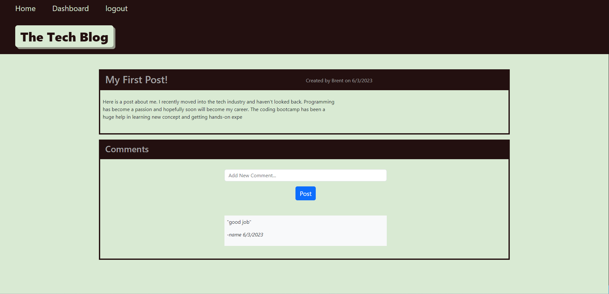

# Technology Blog

# Table of Contents

1. [Description](#description)
2. [License](#license)
3. [Installation](#installation)
4. [Usage](#usage)
5. [Contributing](#contributing)
6. [Testing Instructions](#testing-instructions)
7. [Link](#link)
8. [Screenshots](#screenshots)

## Description
This web app models the functionality of a blog. Users can make accounts, create posts, and comment on posts.

## License
Licensed under the The MIT License    
          

## Installation
Run npm i to install the correct packages. Then use the DB file to create your mysql database and run the seed file in the seeds folder. Add a .env file and adjust the variable names accordingly to match the sequelize connection in the config folder.

## Usage
Use this app as a blogging site for technology topics. Make sure to create a profile in order to create and comment on posts.

## Contributing
N/A

## Tests
N/A

## Link
https://arcane-depths-18823.herokuapp.com/

## Screenshots

